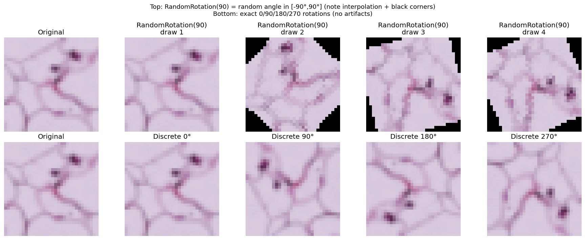

# Robust ML Training

Adversarial training experiments for a 9-class cell image classification task. The goal is to maximize a leaderboard score defined as:

```
score = 0.5 * clean_accuracy + 0.5 * robust_accuracy
```

where robust accuracy is measured under a PGD attack with ε = 10/255.

---

## Dataset

- Square RGB cell images (32×32), 9 classes
- Stored as `train.npz` with keys `images` (uint8, shape `[N, C, H, W]`) and `labels` (int)
- 5000 samples held out for validation with a fixed seed (42) for reproducibility

---

## Approach Evolution

| Script | Attack | Model | Epochs | Notes |
|---|---|---|---|---|
| `train_fgsm.py` | FGSM, ε=8/255 | ResNet18 | 50 | First baseline |
| `train_pdg_version2.py` | PGD, ε=10/255, 10 steps | ResNet50 | 100 | Switch to PGD + larger model |
| `pgd_version4.py` | PGD, ε=10/255, 20 steps | ResNet50 | 130 | Nesterov SGD, earlier milestones |
| `pgd_version4_val_ch.py` | PGD, ε=10/255, 10/20 steps | ResNet50 | 200 | **Best score** — checkpoint saved on val score |
| `pgd_version4_300epoch.py` | PGD, ε=10/255, 10 steps | ResNet50 | 300 | Added ColorJitter, longer schedule |
| `pgd_version5.py` | PGD, ε=10/255, 20 steps | ResNet50 | 200 | Manual LR decay, ColorJitter |
| `pgd_version6.py` | PGD, ε=10/255, 10/20 steps | ResNet50 | 150 | Rotation removed to compare |

---

## The Accidental Augmentation That Worked

During development, `transforms.RandomRotation(90)` was added to the augmentation pipeline. In PyTorch, passing a single integer `n` to `RandomRotation` means a **random continuous angle sampled from `[-n, n]`** — not a fixed 90° rotation. So this applies a random angle uniformly in **[-90°, 90°]**.

Because the images are square cells that do not fill the full rotated canvas, this produces black corner artifacts after interpolation:



We tried replacing this with discrete fixed rotations (0°, 90°, 180°, 270°) to avoid the artifacts. That change **reduced the score**. We also tried removing rotation entirely (`pgd_version6.py`) — same result. The `RandomRotation(90)` configuration consistently outperformed all alternatives.

Our interpretation: the black corner artifacts act as a form of implicit regularization. The model learns to ignore border regions and focus on the central cell content.

---

## Best Configuration — `pgd_version4_val_ch.py`

### Hyperparameters

| Parameter | Value |
|---|---|
| Model | ResNet50 (trained from scratch) |
| Epochs | 200 |
| Batch size | 256 |
| Learning rate | 0.1, decayed ×0.1 at epochs 100 and 150 |
| Optimizer | SGD, momentum=0.9, weight_decay=4e-4 |
| Loss | CrossEntropyLoss with label smoothing=0.1 |
| Gradient clipping | max_norm=1.0 |
| PGD ε | 10/255 |
| PGD α | 2/255 |
| PGD steps (train) | 10 |
| PGD steps (val) | 20 |

### Augmentation

```python
transforms.Compose([
    transforms.RandomCrop(32, padding=4),
    transforms.RandomHorizontalFlip(),
    transforms.RandomVerticalFlip(),
    transforms.RandomRotation(90),   # samples uniform angle in [-90°, 90°]
])
```

### Training Strategy

Each batch is doubled: the augmented clean images and their PGD adversarial counterparts are concatenated and passed through the model in a single forward pass. The checkpoint is saved whenever the validation score (0.5×clean + 0.5×robust) improves.

---

## How to Run

### Requirements

```bash
pip install torch torchvision numpy matplotlib
```

### Data

Place `train.npz` at a path of your choice and update the `data = np.load(...)` line in the script accordingly.

### Training

```bash
python pgd_version4_val_ch.py
```

Update `checkpoint_path` in the script to point to where you want the best model saved.

### Visualization Scripts

```bash
python visualize.py        # class overview and epsilon perturbation reference grid
python rotation.py         # RandomRotation(90) vs discrete fixed rotations comparison
python color_jitter.py     # original vs ColorJitter comparison per class
```

---

## Repository Structure

```
.
├── pgd_version4_val_ch.py      
├── pgd_version4.py             
├── pgd_version4_300epoch.py    
├── pgd_version5.py             
├── pgd_version6.py             
├── train_pdg_version2.py       
├── train_fgsm.py               
├── visualize.py               
├── rotation.py                 
├── color_jitter.py             
├── visualize_classes.png       
├── visualize_epsilon.png       
├── rotation_augmentation.png   
└── colorjitter_compare.png    
```
